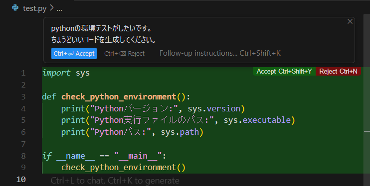
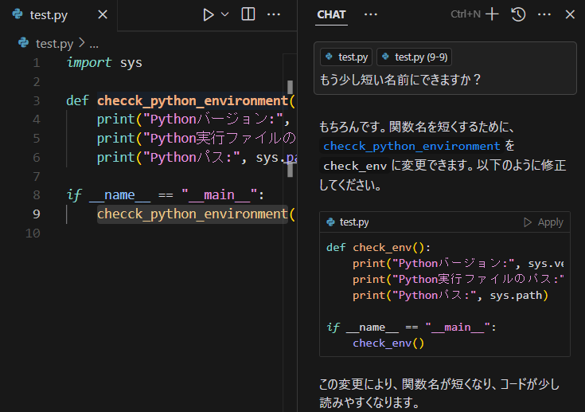
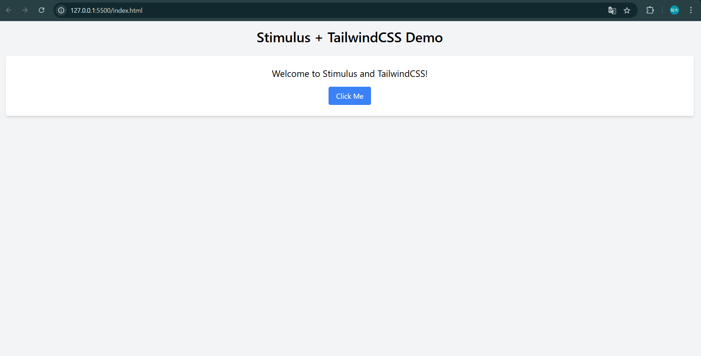

# Web Dev Practice - README

Cursor, Stimulus, TailwindCSSを使用したウェブ開発の練習用リポジトリです。

## ✅ 事前学習で行ったこと

### 📘 事前知識
- Web開発の経験がなかったのでHTML, JavaScript, CSSの概要や他のプログラミング言語との在り方の違いを調べました。
  (途中までPythonでCursorを試しています。)
- 参考にしたサイト
  - https://www.akkodis.co.jp/candidate/insight/column_29
  - https://qiita.com/non_cal/items/a8fee0b7ad96e67713eb
  - https://qiita.com/GRGSIBERIA/items/b8cd4a2b3635d1bb0391

### 🔧 Cursor
- Privacy modeをenableに
- OpenAIのAPI Keyを登録
- 拡張機能から以下をインストール：
  - ESLint
  - Live Server
  - Node.js Modules Intellisense
- 機能を試してみた

  
コードを生成する例(Python)

チャットからコードを改変する例

### 📦 Stimulus.js
- Node.jsのインストール
- npmからStimulusのインストール

### 🎨 TailwindCSS
- CDNで利用

---

### ChatGPTを活用してページを作ってみる

作ったページ

CSS, JavaScriptの動作をそれぞれTailwindCSS, Stimulus.jsがHTML内の属性で記述できるようにしている

⇒ 小規模なものならひとつのHTMLファイルでページを作れる、という理解をしています。